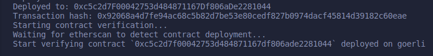
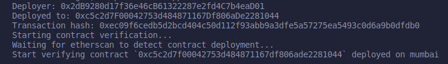
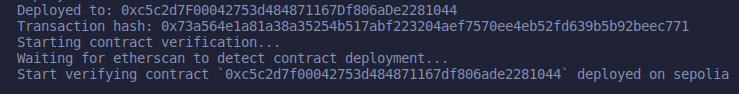

# Contract Address Manipulation

Contract addresses are determined by the deployer address and the transaction nonce of the deployer address on the given chain. By using the same deployer EoA and transaction nonce on each chain, the address of the contract will be the exact same on each chain. This can be helpful for many reasons, mainly for easier documentation and user experience.

# Sample contract deployed to Goerli testnet

[Goerli Sample Contract](https://goerli.etherscan.io/address/0xc5c2d7f00042753d484871167df806ade2281044)

# Sample contract deployed to Mumbai testnet

[Mumbai Sample Contract](https://mumbai.polygonscan.com/address/0xc5c2d7f00042753d484871167df806ade2281044)

# Sample contract deployed to Sepolia testnet

[Sepolia Sample Contract](https://sepolia.etherscan.io/address/0xc5c2d7f00042753d484871167df806ade2281044)

# Source
[Prashant Nigam Article](https://dev.to/prashant/how-to-deploy-a-smart-contract-to-the-same-address-across-different-blockchains-39jf)